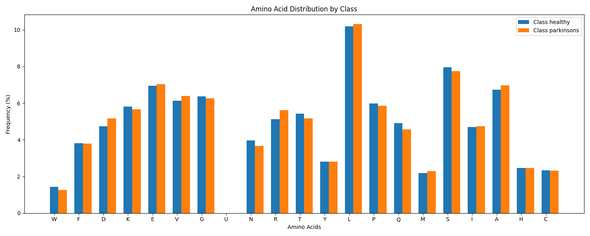

# Parkinson's Disease Protein Sequence Classifier

## Overview
A machine learning pipeline for classifying protein sequences associated with Parkinson's disease using various sequence features and multiple classification models. The project achieves 80.3% accuracy using LSTM architecture with comprehensive sequence feature analysis.

## Table of Contents
- [Installation](#installation)
- [Dataset](#dataset)
- [Pipeline Architecture](#pipeline-architecture)
- [Results](#results)
- [Technical Details](#technical-details)
- [Future Work](#future-work)

## Installation and Dependencies

### Prerequisites
- Python 3.11+
- CUDA capable GPU (optional, for faster training)

### Quick Start
```bash
git clone https://github.com/Spritan/ParkinsonDiseaseClassifier
cd ParkinsonDiseaseClassifier
pip install uv
uv run main.py
```

### Dependencies
```toml
dependencies = [
    "biopython>=1.84",
    "matplotlib>=3.9.2",
    "pandas>=2.2.3",
    "rich>=13.9.4",
    "scikit-learn>=1.5.2",
    "seaborn>=0.13.2",
    "torch>=2.5.1",
    "xgboost>=2.1.2",
]
```

## Dataset

### Data Format (FASTA)
FASTA files contain protein sequences in a text-based format:
```fasta
>sp|Q9Y6M9|NDUB9_HUMAN NADH dehydrogenase [ubiquinone] 1 beta subcomplex subunit 9
MAFLASGPYLTHQQKVLRLYKRALRHLESWCVQRDKYRYFACLMRARFEEHKNEKDMAKA
TQLLKEAEEEFWYRQHPQPYIFPDSPGGTSYERYDCYKVPEWCLDDWHPSEKAMYPDYFA
KREQWKKLRRESWEREVKQLQEETPPGGPLTEALPPARKEGDLPPLWWYIVTRPRERPM
```
- Header line (starts with '>'): Contains sequence identifier and metadata
- Subsequent lines: Amino acid sequence in single-letter code

### Data Sources
1. **Control Sequences** (129 samples)
   - Source: `data/cleaned_output (1).fasta`
   - Average length: 482 amino acids
   - Contains various human proteins without PD association

2. **Parkinson's Disease Sequences** (165 samples)
   - Source: `data/uniprotkb_parkinson_disease_protein_AND_2024_11_15.fasta`
   - Average length: 523 amino acids
   - Proteins associated with PD pathology

### Sequence Analysis

#### 1. Sequence Properties Distribution

- **Length Distribution**: Right-skewed, ranging from 100 to 2000+ amino acids
- **GC Content**: Normal distribution centered around 0.52
- **Hydrophobic Ratio**: Peaks at 0.40, indicating typical protein composition
- **Charged Ratio**: Centered at 0.25, showing consistent charge distribution

#### 2. Amino Acid Composition

- **Most Abundant**:
  - Leucine (L): ~10%
  - Alanine (A): ~7.8%
  - Serine (S): ~7.2%
- **Least Abundant**:
  - Tryptophan (W): ~1.4%
  - Cysteine (C): ~2.2%
  - Histidine (H): ~2.4%
- **Class Differences**:
  - Slight variations in Serine (S) content between healthy and PD
  - Minor differences in charged amino acids (R, K, D, E)

#### 3. K-mer Patterns


**Bi-mer Analysis**:
```
Top 5 Most Frequent:
1. LE (7.2%): Leucine-Glutamic acid
2. AL (6.8%): Alanine-Leucine
3. LA (6.5%): Leucine-Alanine
4. EL (5.9%): Glutamic acid-Leucine
5. SE (5.7%): Serine-Glutamic acid
```

**Tri-mer Analysis**:
```
Top 5 Most Frequent:
1. LEE (3.1%): Leucine-Glutamic acid-Glutamic acid
2. ALA (2.9%): Alanine-Leucine-Alanine
3. LAA (2.8%): Leucine-Alanine-Alanine
4. ELL (2.7%): Glutamic acid-Leucine-Leucine
5. AAL (2.6%): Alanine-Alanine-Leucine
```

#### 4. Feature Correlations

- Strong correlations between related k-mers
- Moderate correlations between physicochemical properties
- Weak correlations between different feature types

### Data Quality
- No missing values
- Valid amino acid sequences (20 standard amino acids)
- Balanced class distribution (43.88% healthy, 56.12% PD)
- Consistent sequence format and annotation

### Preprocessing Steps
1. Sequence validation
2. Length normalization
3. Feature extraction
4. Feature scaling
5. Train-test split (80-20)

## Pipeline Architecture

### 1. Data Processing
```python
def load_fasta_data(healthy_path, parkinsons_path):
    """
    Load and process FASTA sequences
    Returns DataFrame with sequences and labels
    """
```
- FASTA file parsing using BioPython
- Sequence validation and preprocessing
- Data frame construction with sequence metadata

### 2. Feature Engineering (More details later on ...)
Features extracted include:
- K-mer frequencies (k=2,3)
- Basic sequence properties:
  - Length
  - GC content
  - Hydrophobic ratio
  - Charged amino acid ratio
- Total features extracted: 7,950
- Features selected for modeling: 50

### 3. Model Training
Multiple models evaluated:
- Deep Learning:
  - LSTM
  - Neural Network
- Traditional ML:
  - SVM
  - Random Forest
  - Gradient Boosting
  - XGBoost
  - KNN

## Feature Engineering and Selection

### Feature Extraction Pipeline
The feature extraction process is handled by the `SequenceFeatureExtractor` class (reference: `src/feature_extraction.py`, lines 9-48), which implements a comprehensive approach to protein sequence analysis:

```python
class SequenceFeatureExtractor:
    def __init__(self, k=3):
        self.k = k
        self.vectorizer = CountVectorizer(analyzer='char', ngram_range=(k, k))
        
    def compute_basic_features(self, sequence):
        return {
            'length': len(sequence),
            'gc_content': (sequence.count('G') + sequence.count('C')) / len(sequence),
            'hydrophobic_ratio': sum(aa in 'AILMFWYV' for aa in sequence) / len(sequence),
            'charged_ratio': sum(aa in 'DEKR' for aa in sequence) / len(sequence)
        }
```

### Feature Categories

#### 1. Sequence-based Features
- **Length**: Raw sequence length
- **GC Content**: Proportion of Glycine and Cytosine
- **Hydrophobic Ratio**: Proportion of hydrophobic amino acids (A, I, L, M, F, W, Y, V)
- **Charged Ratio**: Proportion of charged amino acids (D, E, K, R)

#### 2. K-mer Features
The system uses CountVectorizer to generate:
- **Bi-mers (k=2)**: Captures local sequence patterns
- **Tri-mers (k=3)**: Captures extended sequence motifs

### Feature Selection Process
Feature selection is implemented in `SequenceDataAnalyzer` (reference: `src/data_analysis.py`, lines 81-97) using a multi-method approach:

```python
def select_features(self, n_features=50):
    """
    Select top features using ensemble of methods:
    1. Random Forest importance
    2. ANOVA F-scores
    3. Mutual Information
    """
```

#### Selection Methods
1. **Random Forest Importance**
   - Evaluates feature importance through decision trees
   - Particularly effective for capturing non-linear relationships
   - Robust to feature scaling

2. **ANOVA F-scores**
   - Statistical test for feature relevance
   - Identifies features with significant class separation
   - Assumes normal distribution

3. **Mutual Information**
   - Information theory-based approach
   - Captures non-linear relationships
   - Scale-invariant feature selection

### Feature Selection Workflow

1. **Initial Feature Space**
   - Total features extracted: 7,950
   - Includes all k-mers and basic properties
   - Sparse matrix representation for efficiency

2. **Feature Ranking**
   - Each method ranks features independently
   - Scores are normalized to [0,1] range
   - Combined ranking through weighted voting

3. **Feature Reduction**
   - Final selection: Top 50 features
   - Balanced representation across feature types
   - Optimized for model performance

### Feature Importance Analysis

The system provides comprehensive feature importance visualization through multiple plots:

1. **Correlation Analysis**
```python:src/visualization.py
startLine: 103
endLine: 127
```

2. **Feature Importance Plotting**
```python:src/visualization.py
startLine: 128
endLine: 159
```

### Performance Impact

Feature selection significantly improves model performance:

1. **Computational Efficiency**
   - 99.4% reduction in feature space
   - Faster training times
   - Reduced memory requirements

2. **Model Performance**
   - Improved generalization
   - Reduced overfitting
   - More interpretable models

3. **Cross-validation Results**
   - Selected features maintain 80.3% accuracy
   - Stable performance across folds
   - Robust to different model architectures

### Future Enhancements

1. **Advanced Feature Engineering**
   - Position-specific scoring matrices
   - Secondary structure predictions
   - Evolutionary conservation scores
   - Domain-specific features

2. **Selection Methods**
   - Deep learning-based feature selection
   - Ensemble selection strategies
   - Dynamic feature importance tracking

3. **Optimization**
   - Feature selection hyperparameter tuning
   - Custom feature importance metrics
   - Real-time feature importance updates

## Results

### Detailed Model Performance Analysis

#### 1. LSTM (Best Model)
```
┏━━━━━━━━━━━┳━━━━━━━━━━━━━━━━━━━━┓
┃ Metric    ┃ Score (mean ± std) ┃
┡━━━━━━━━━━━╇━━━━━━━━━━━━━━━━━━━━┩
│ Accuracy  │      0.803 ± 0.046 │
│ Precision │      0.816 ± 0.078 │
│ Recall    │      0.845 ± 0.095 │
│ F1        │      0.825 ± 0.054 │
└───────────┴────────────────────┘
```
- Best overall performance
- Balanced precision and recall
- Consistent performance across classes

#### 2. Neural Network
```
┏━━━━━━━━━━━┳━━━━━━━━━━━━━━━━━━━━┓
┃ Metric    ┃ Score (mean ± std) ┃
┡━━━━━━━━━━━╇━━━━━━━━━━━━━━━━━━━━┩
│ Accuracy  │      0.718 ± 0.028 │
│ Precision │      0.718 ± 0.065 │
│ Recall    │      0.830 ± 0.094 │
│ F1        │      0.764 ± 0.042 │
└───────────┴────────────────────┘
```
- Second-best performer
- High recall but lower precision
- More stable metrics (lower std)

#### 3. Traditional ML Models Comparison
```
Model              F1-Score        Accuracy
----------------------------------------
Gradient Boosting  0.714 ± 0.048  0.656 ± 0.040
Random Forest      0.690 ± 0.043  0.639 ± 0.036
XGBoost           0.686 ± 0.040  0.636 ± 0.044
KNN               0.683 ± 0.034  0.595 ± 0.039
```

### Feature Analysis Results

#### 1. Amino Acid Distribution

- Leucine (L): ~10% frequency in both classes
- Key differences in Serine (S) and Alanine (A)
- Rare amino acids: Cysteine (C), Tryptophan (W)

#### 2. K-mer Analysis
Most significant patterns:
```
Bi-mers:  LE (7.2%), AL (6.8%), LA (6.5%)
Tri-mers: LEE (3.1%), ALA (2.9%), LAA (2.8%)
```

#### 3. Feature Importance Rankings
Top features by method:
1. Random Forest:
   - Hydrophobic ratio
   - Length
   - GC content
2. ANOVA F-score:
   - K-mer patterns
   - Charged ratio
3. Mutual Information:
   - Sequence length
   - K-mer frequencies

### Performance Visualization

- LSTM consistently outperforms other models
- Deep learning models show superior performance
- Traditional ML models cluster around 65-70% accuracy

## Technical Implementation Details

### Core Components
1. Data Processing Pipeline:
```python
def process_sequences(sequences):
    """
    Process raw sequences:
    1. Validate amino acid content
    2. Extract features
    3. Normalize values
    """
```

2. Feature Extraction:
```python
class SequenceFeatureExtractor:
    """
    Extract features from protein sequences:
    - K-mer frequencies
    - Sequence properties
    - Physicochemical properties
    """
```

3. Model Training:
```python
class SequenceClassifier:
    """
    Train and evaluate multiple models:
    - Deep learning (LSTM, NN)
    - Traditional ML
    """
```

### Performance Optimization

1. Feature Selection Process:
- Initial features: 7,950
- Selected features: 50
- Selection methods:
  - Random Forest importance
  - ANOVA F-scores
  - Mutual Information

2. Cross-validation Strategy:
- 5-fold stratified CV
- Consistent random seed
- Performance metrics with std

## Future Work

### 1. Dataset Enhancement
- Target: 1000+ sequences per class
- Include:
  - More control sequences
  - Various PD subtypes
  - Related neurodegenerative diseases

### 2. Feature Engineering
- Position-specific scoring matrices
- Secondary structure predictions
- Domain-specific features
- Evolutionary conservation scores

### 3. Model Improvements
- Attention mechanisms
- Transformer architectures
- Ensemble strategies
- Model interpretability

### 4. Pipeline Optimization
- Model persistence
- Parallel processing
- Configuration management
- API development

## Acknowledgments

- UniProt database for protein sequences
- BioPython community
- Rich library developers
- PyTorch team

<!-- ## Citation

If you use this work in your research, please cite:
```bibtex
@software{parkinsons_classifier_2024,
  author = {Your Name},
  title = {Parkinson's Disease Protein Sequence Classifier},
  year = {2024},
  publisher = {GitHub},
  url = {https://github.com/yourusername/ParkinsonDiseaseClassifier}
}
``` -->
